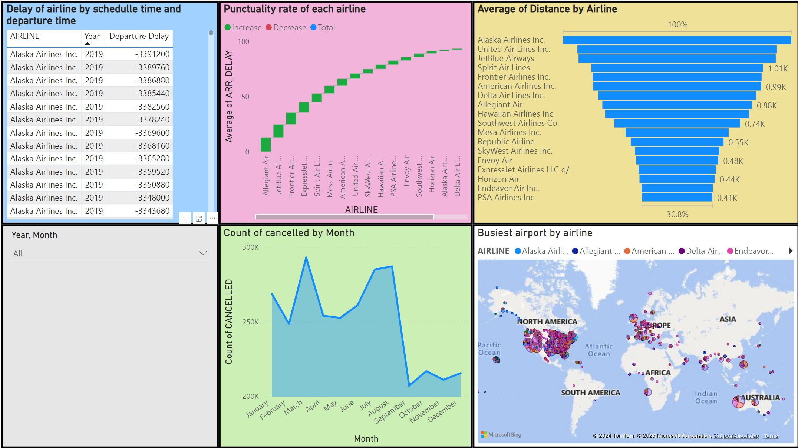

# Flight-Delay-and-Cancellation-Analysis-using-PowerBI

### Flight-Delay-Analysis

### Flight Delay Analysis Dashboard
The dashboard provides a comprehensive analysis of flight delays using Power BI, offering insights into the following aspects:

#### Year and Quarter Filter:

An interactive slicer to filter data by year and quarter for customized insights.
#### Average Arrival Delay of Airlines:

A Stacked bar chart highlighting the average arrival delays for various airlines, allowing users to identify carriers with the most delays.
#### Average Departure Delay by Origin:

A Clustered Column chart displaying average departure delays for different origin airports, enabling comparisons of delay times across locations.
#### Average Departure Delay by each Month:

A line graph depicting the average departure delay for each month over multiple years. This helps to observe trends and seasonal patterns in delays.
#### Frequency of Departure Delays by Reasons:

A pie chart illustrating the proportion of delays caused by different factors, including carriers, weather, NAS (National Airspace System), and instances with no delays.
#### Count of Delay Ranges by Airline:

A Stacked Column chart categorizing delays into ranges (e.g., 0–15 mins, 16–30 mins, etc.) for each airline. This provides detailed insights into the severity of delays experienced by different carriers.

### Flight-Cancellation-Analysis 

### Flight-Operations-Analysis

